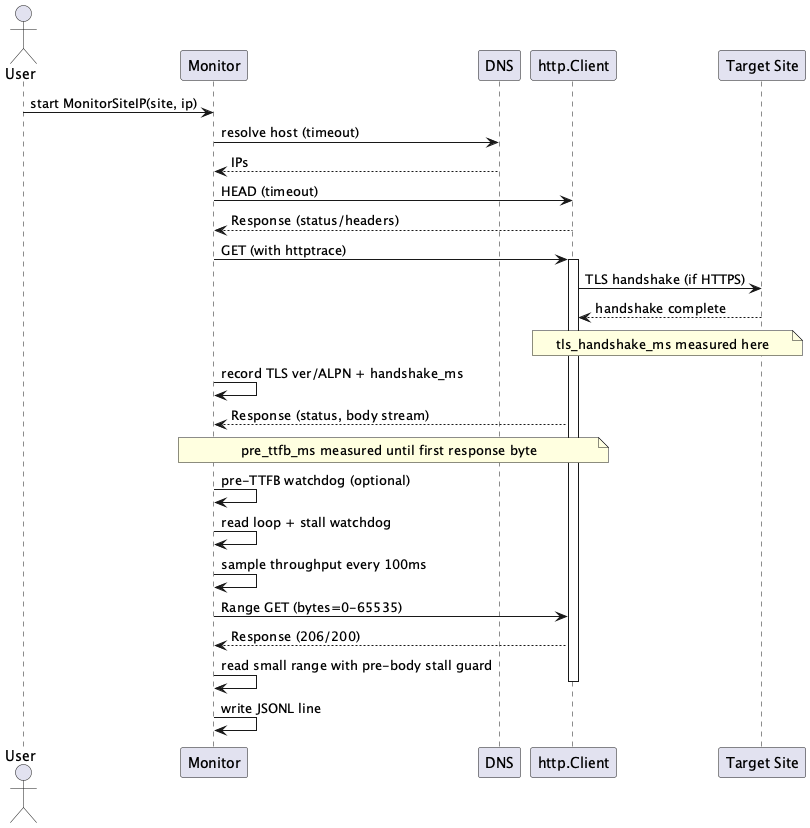

# InternetQualityMonitor — Architecture

This document describes the system architecture: components, data flows, runtime sequences, and deployment. It complements the Design Criteria; see DESIGN_CRITERIA.md for principles, constraints, goals, and non‑goals.

- Design principles: see DESIGN_CRITERIA.md
- Project overview: see README.md
- Analysis reference: see README_analysis.md
- Viewer docs: see README_iqmviewer.md

## High‑level overview

Core components and their responsibilities:
- Monitor (collector)
  - Actively measures sites via HEAD → GET → Range GET
  - Records timings (DNS/TCP/TLS handshake, TTFB), protocol/TLS/ALPN, throughput samples, stall signals
  - Writes JSON Lines to monitor_results.jsonl
- Analysis (library/CLI)
  - Reads recent batches from JSONL; aggregates Overall/IPv4/IPv6
  - Computes percentiles, stall and micro‑stall metrics, protocol/TLS mixes
  - Emits summaries for UI and headless screenshots; can emit alerts JSON
- Viewer (desktop UI)
  - Loads analysis summaries, renders charts, exports PNGs/screenshots
- Reader CLIs
  - iqmreader/iqminspect: quick batch counts, summaries, status

## Component diagram


Details (PlantUML source):
<details>
<summary>Show PlantUML</summary>

```plantuml
@startuml IQMComponents
!include docs/diagrams/IQMComponents.puml
@enduml
```

</details>

## Data model (brief)

- Per line: ResultEnvelope { meta, site_result } (schema_version=3)
- Key telemetry: DNS/TCP/TLS/TTFB, tls_handshake_ms, speeds and samples, stall signals, protocol (HTTPProtocol), TLSVersion, ALPN, headers (Age/X‑Cache/Via), proxy heuristics, IPv4/IPv6 family
- DNS server used (best‑effort): dns_server, dns_server_network
- Network next hop (best‑effort): next_hop, next_hop_source (iproute2/route)
- Batches keyed by meta.run_tag; summaries computed per batch (Overall/IPv4/IPv6)

See README_analysis.md for the full list of derived metrics.

## Monitor measurement sequence



Details (PlantUML source):
<details>
<summary>Show PlantUML</summary>

```plantuml
@startuml MonitorSequence
!include docs/diagrams/MonitorSequence.puml
@enduml
```

</details>

Notes:
- Single transient retry for HEAD/GET/Range on EOF/reset; flags recorded.
- Protocol/TLS fields are populated from GET; if GET fails, populated from HEAD/Range when available.
- For HTTPS targets, the monitor records TLS handshake timing (tls_handshake_ms) and captures TLS version and ALPN negotiated during the handshake.
- In the sequence diagram, yellow notes highlight where timings are taken:
  - tls_handshake_ms measured during the TLS handshake between client and site
  - pre_ttfb_ms measured from request until the first response byte

## Analyze‑only flow


Details (PlantUML source):
<details>
<summary>Show PlantUML</summary>

```plantuml
@startuml AnalyzeOnly
!include docs/diagrams/AnalyzeOnly.puml
@enduml
```

</details>

## Viewer rendering flow


Details (PlantUML source):
<details>
<summary>Show PlantUML</summary>

```plantuml
@startuml ViewerFlow
!include docs/diagrams/ViewerFlow.puml
@enduml
```

</details>

## Deployment view


Details (PlantUML source):
<details>
<summary>Show PlantUML</summary>

```plantuml
@startuml Deployment
!include docs/diagrams/Deployment.puml
@enduml
```

</details>

## Quality attributes (mapped to design criteria)

- Reliability: explicit timeouts; one‑shot retries; stall detection; partial‑body detection
- Performance: streaming analysis; bounded memory; deterministic render/export widths
- Security/Privacy: honors env proxy; optional TLS cert subject/issuer for proxy detection; no secrets written
- Operability: clear logs; explicit flags; analyze‑only uses --input; alerts written to alerts_*.json

See DESIGN_CRITERIA.md for tenets and acceptance examples.

## Rendering the diagrams

- Pre‑rendered images are checked in under docs/images so diagrams display without a PlantUML server.
- PlantUML source lives in docs/diagrams. Regenerate PNGs (local‑first, no Docker required):
  - Local (preferred): ensure `plantuml` is on PATH, then run `./scripts/update_diagrams.sh`
  - Make (local‑first): `make diagrams` (uses local plantuml; falls back to Docker if local is missing)
  - Docker (optional fallback): if you prefer a container, `make diagrams` will use `plantuml/plantuml` when local isn’t available

## References

- DESIGN_CRITERIA.md — principles, goals, constraints
- README.md — project overview, usage
- README_analysis.md — metrics and analysis options
- README_iqmviewer.md — UI behavior, screenshots
- REQUIREMENTS.md — reader/viewer requirements