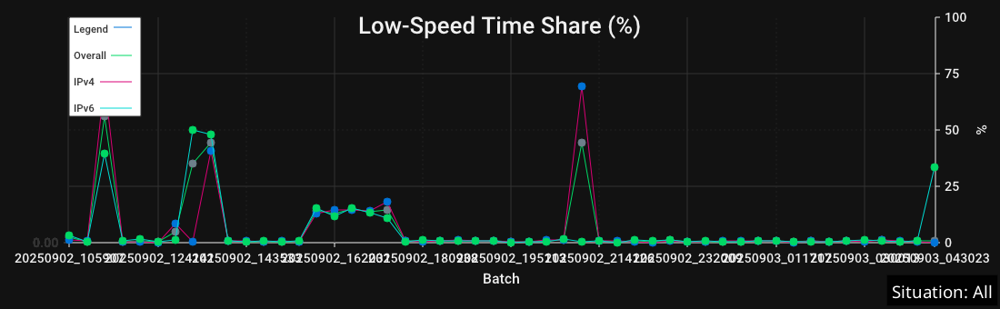
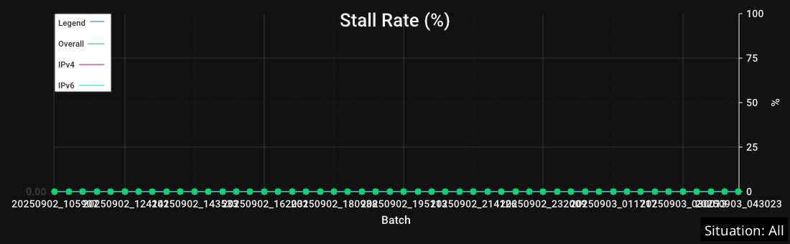
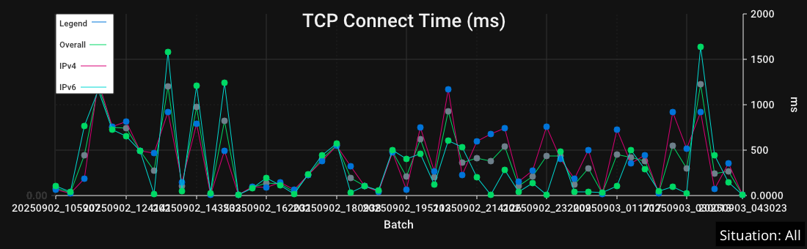
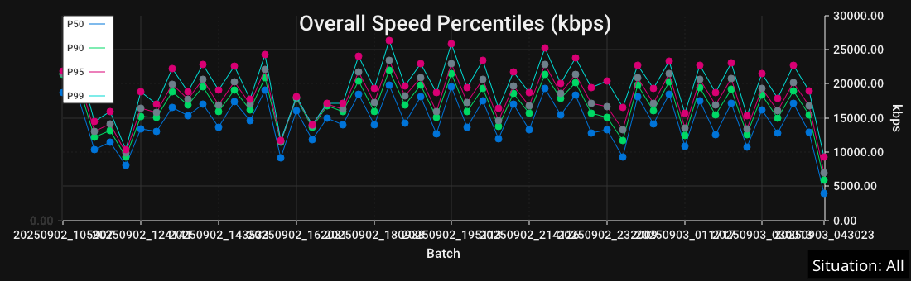
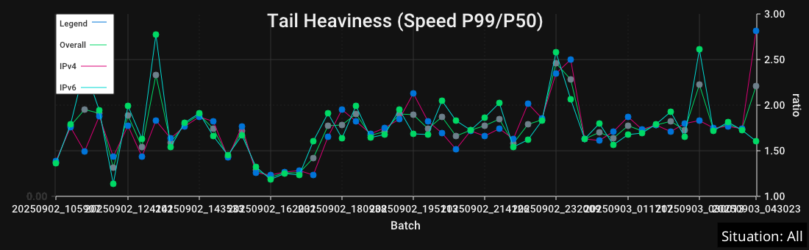
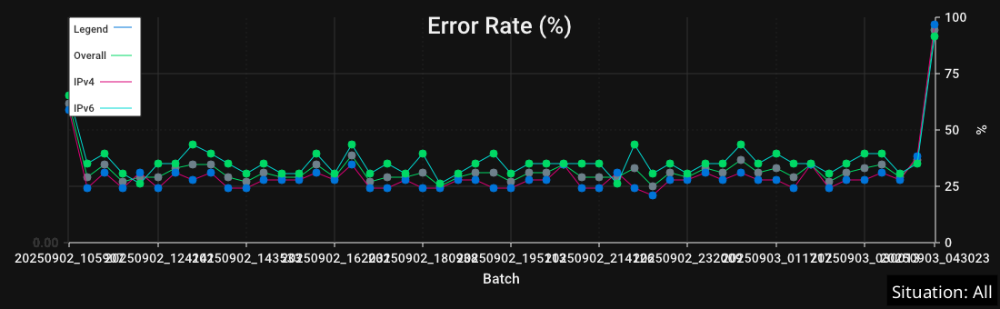
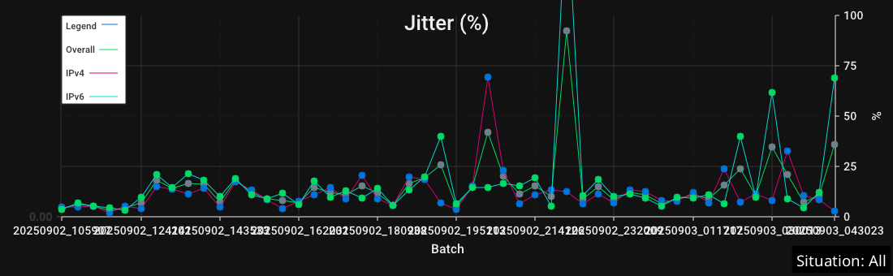

# iqmviewer

A Fyne-based desktop viewer for InternetQualityMonitor results with clear charts, robust filtering by Situation, rolling trend overlays, and export-ready watermarks.

- All charts render at 100% of the available width, across the entire viewer.
- The toolbar is horizontally scrollable so the window can be resized to narrow widths.
- The window can be freely resized; redraws are debounced to avoid feedback loops.

## Build and run

```
go build ./cmd/iqmviewer
./iqmviewer -file monitor_results.jsonl
```

You can also launch without a flag and open a file via File → Open (Cmd/Ctrl+O).

Tip: To seed the Pre‑TTFB chart visibility on launch, use `--show-pretffb=true|false` (the choice is saved to preferences).

## Features at a glance
- Load `monitor_results.jsonl` and display the latest N batches (grouped by `run_tag`).
- Situation filter with "All" option (default). The active Situation appears as a subtle on-image watermark and is embedded into exports.
- X-axis modes: Batch, RunTag, and Time (Settings → X-Axis) with rounded ticks. Y-scale: Absolute or Relative (Settings → Y-Scale).
- Speed units: kbps, kBps, Mbps, MBps, Gbps, GBps (select under Settings → Speed Unit).
- Crosshair overlay: theme-aware, follows mouse, label with semi-transparent background; hidden outside drawn area.
- PNG export for each chart plus an "Export All (One Image)" that mirrors the on-screen order.
	- After saving, the viewer confirms the export destination.
- Quick find: toolbar Find field filters by chart title and lets you jump Prev/Next between matches; count shows current/total.
- Keyboard shortcuts: Open (Cmd/Ctrl+O), Reload (Cmd/Ctrl+R), Close window (Cmd/Ctrl+W), Find (Cmd/Ctrl+F).
 - Keyboard shortcuts: Open (Cmd/Ctrl+O), Reload (Cmd/Ctrl+R), Close window (Cmd/Ctrl+W), Find (Cmd/Ctrl+F), Diagnostics (Cmd/Ctrl+D), Find Next (Cmd/Ctrl+G), Find Prev (Shift+Cmd/Ctrl+G).
 - New setup timing charts: DNS Lookup Time (ms), TCP Connect Time (ms), TLS Handshake Time (ms), each split Overall/IPv4/IPv6.
- Cache/proxy analytics: split Enterprise Proxy Rate and Server-side Proxy Rate charts. The legacy combined "Proxy Suspected Rate" chart is deprecated and hidden in the UI (kept in analysis data for compatibility).
 - Info popups follow consistent design criteria; see `docs/ui/info_popup_design_criteria.md`.

### Diagnostics dialog
- How to open:
	- Click a row in the Batches table to open a per‑batch Diagnostics dialog.
	- Or right‑click a table row and choose “Diagnostics…”.
 	- Or press Cmd/Ctrl+D to open Diagnostics for the current selection (or first row if none selected).
 
- What you’ll see:
	- DNS server and network used (best‑effort), plus network Next Hop and its source (macOS/Linux).
	- Local Throughput Self‑Test baseline (kbps) captured by the viewer on startup.
	- Proxy hints: whether a proxy was used, any proxy names seen, and env‑proxy usage rate.
	- TLS/ALPN majority: the most common negotiated TLS version and ALPN (e.g., h2, http/1.1).
	- Cache and path indicators: cache‑hit rate, warm‑cache suspected rate, prefetch suspected rate, IP mismatch rate, connection reuse rate, and chunked transfer rate.
	- Stability highlights: stall rate, transient (micro‑stall) rate, Low‑Speed Time Share, Pre‑TTFB stall rate.
	- Setup timing averages: DNS, TCP connect, and TLS handshake means for the batch.
- Notes:
	- Values are batch aggregates or “latest observed” within the batch where applicable (e.g., DNS server, Next Hop).
	- DNS/Next‑hop are best‑effort: availability depends on OS and resolver/routing introspection.
	- Empty/unknown values are shown as “–”.
 - Copy options:
	- Copy copies the human‑readable diagnostics text.
	- Copy JSON copies a compact JSON blob with key diagnostics for sharing or filing issues.
	- Copy traceroute copies an OS‑appropriate traceroute command prefilled with the batch’s next hop (disabled if next hop is unknown).
	- Copy ping copies a quick ping command targeting the next hop (disabled if next hop is unknown).
	- Copy mtr copies an mtr report command when available on macOS/Linux (disabled if mtr is not installed or on Windows).
	- Copy curl -v copies a verbose curl command for a representative URL from the batch; adds an HTTP version hint when a clear majority is detected.
 - Readability: The dialog uses theme‑aware rich text for better contrast and wrapping.

#### Capture a Diagnostics screenshot or GIF
You can add a visual of the Diagnostics dialog to your docs or bug reports:

Option A (macOS UI):
- Open the viewer and click a batch row to open Diagnostics.
- Press Shift+Cmd+5 → choose “Capture Selected Window” → click the Diagnostics window.
- Save as `docs/images/diagnostics_dialog.png` so it shows up alongside other screenshots.

Option B (macOS CLI, window snapshot):
```
screencapture -w docs/images/diagnostics_dialog.png
```
Then click the Diagnostics window to capture it.

#### Troubleshoot quickly with traceroute

Use the “Copy traceroute” button in the Diagnostics dialog to copy a ready‑to‑paste command that targets the detected next hop.
- On macOS/Linux it uses `traceroute -n <nextHop>`.
- On Windows it uses `tracert <nextHop>`.
Paste into your terminal to inspect the path. If the button is disabled, the next hop wasn’t detected for that batch.

You can also use “Copy ping” for a quick reachability/latency probe, and “Copy mtr” (if installed) for a continuous path quality report.

Option C (short video/GIF):
- Record a short screen capture (Control Center → Screen Recording or QuickTime → New Screen Recording), then convert to GIF with your preferred tool (e.g., gifski). Keep it brief (<5s) for readability.

Notes:
- If you record a GIF, keep the capture region tight around the dialog to reduce size.
- Theme follows the viewer’s current theme (Auto/Dark/Light).

### Settings menu
- Crosshair, Hints, Rolling Mean overlay, and ±1σ Band toggles
- Overlay legacy DNS (dns_time_ms) toggle for the DNS chart
- Pre‑TTFB Chart: show/hide the Pre‑TTFB Stall Rate section
- Auto‑hide Pre‑TTFB (zero): when enabled, hides the Pre‑TTFB section if the metric is zero across all visible series/batches
- X-Axis: Batch, RunTag, Time
- Y-Scale: Absolute, Relative
- Batches…: set recent N batches
- Speed Unit: kbps, kBps, Mbps, MBps, Gbps, GBps
- Screenshot Theme: Auto, Dark, Light

### Selection
- Selection is session-only: the last clicked batch (RunTag) is remembered only within the current session and restored after reloads during the session. It is not persisted across app restarts.
- Right‑click on a table row opens the Diagnostics dialog for that batch.

### Layout and sizing
- Full-width charts: images use a stretch fill to visually occupy the entire available width.
- Flexible window size: the window can be made narrow; the toolbar scrolls horizontally when there’s not enough space.
- Debounced resize: viewer redraws on meaningful width changes only (guarded to prevent jitter-driven redraw loops).

### Theme selection
- Settings → Screenshot Theme: Auto (default), Dark, Light.
- Auto follows the system appearance on macOS; other OSes default to Light unless you pick Dark.
- All charts and overlays are theme-aware (no stray white fills). Hints and watermarks use high-contrast colors per theme.

Headless equivalents:
- `--screenshot-theme` accepts `auto`, `dark`, or `light`.
- Extra average “action” variants (time-axis and relative-scale) are gated by `--screenshot-variants` (`averages` or `none`).
- Pre‑TTFB chart include: `--screenshot-pretffb=true|false` (default true) controls including the Pre‑TTFB chart when data is present.

## Stability & quality charts

- Low‑Speed Time Share (%): Share of total transfer time spent below the Low‑Speed Threshold. Highlights choppiness even when averages look OK. Plotted for Overall, IPv4, and IPv6.
- Stall Rate (%): Percent of requests that experienced any stall (transfer paused). Useful to spot buffering/outage symptoms.
- Pre‑TTFB Stall Rate (%): Percent of requests aborted before the first byte due to a pre‑TTFB stall. Optional auto‑hide when the metric is zero across all batches (Settings → “Auto‑hide Pre‑TTFB (zero)”). Requires running the monitor with `--pre-ttfb-stall` to record this signal. You can show/hide the chart via Settings → “Pre‑TTFB Chart”, or seed it on launch with `--show-pretffb=true|false`.
- Partial Body Rate (%): Percent of requests that returned an incomplete body (Content‑Length mismatch or early EOF). Plotted for Overall, IPv4, and IPv6. Full‑width, crosshair‑enabled, and exportable; included in headless screenshots as `partial_body_rate.png`.
- Avg Stall Time (ms): Average total stalled time per stalled request. Higher means longer buffering events.
- Stalled Requests Count: Derived as round(Lines × Stall Rate%). Quick absolute sense of how many requests stalled in a batch.
 - Transient Stall Rate (%): Share of requests that had one or more short stalls where transfer resumed (aka micro‑stalls). Separate from Stall Rate (which includes hard stalls/aborts). Default micro‑stall gap threshold is ≥500 ms. Exportable and included in screenshots as `transient_stall_rate.png`.
 - Avg Transient Stall Time (ms): Average total duration of micro‑stalls per affected request. Exportable and included in screenshots as `transient_stall_time.png`.
 - Avg Transient Stall Count: Average number of micro‑stall events per request (among lines with any micro‑stall). Exportable and included in screenshots as `transient_stall_count.png`.

Examples:






Transient/micro‑stalls:


## Setup timing charts (connection setup)

- DNS Lookup Time (ms): Mean DNS resolution time per batch (Overall/IPv4/IPv6). Helps spot resolver slowness or cache coldness.
- TCP Connect Time (ms): Mean TCP handshake time per batch. Useful for path RTT shifts or congestion.
- TLS Handshake Time (ms): Mean TLS setup time per batch. Highlights certificate/inspection overhead or handshake retries.

DNS data sources and overlay
- Preferred source is httptrace (trace_dns_ms). When unavailable, the legacy dns_time_ms is used.
- You can also overlay the legacy pre-resolve series: Settings → “Overlay legacy DNS (dns_time_ms)” adds a dashed overlay for comparison (Overall/IPv4/IPv6).
	- Headless: pass --screenshot-dns-legacy=true (or set the 7th arg to true in update_screenshots.sh) to include the dashed overlay in docs screenshots.

Examples:





Low‑Speed Threshold control

- Settings → “Low‑Speed Threshold (kbps)” sets the cutoff used for Low‑Speed Time Share.
- Persisted in preferences and applied immediately on change (data is re‑analyzed).
- Default: 1000 kbps. Tune to your baseline (e.g., 500 for low‑bandwidth links, 2000 for HD video expectations).
- Exports: Individual and combined PNG exports include the active Situation watermark. The threshold affects Low‑Speed Time Share only; stall metrics are independent.

## Rolling overlays: mean and ±1σ band

- Rolling window: Default N = 7 batches (persisted). Change via Settings → “Rolling Window (N)”.
- Overlays available on Avg Speed and Avg TTFB charts:
	- Rolling Mean (μ): a smoothed trend line over the last N batches.
	- ±1σ Band: translucent band between μ−σ and μ+σ.
- Independent toggles:
	- Settings → “Rolling Overlays” toggles the mean line.
	- Settings → “±1σ Band” toggles the band separately from the mean.
- Legend: a single entry “Rolling μ±1σ (N)” appears per chart when the band is enabled. The mean line label remains concise.
- Help: Speed/TTFB help dialogs include a quick hint explaining the μ±1σ band and how the window N affects smoothing and band width.

Example (Avg Speed with Rolling overlays):


## Local Throughput Self-Test (baseline)

- On startup, the viewer runs a short local loopback throughput self-test by default and records the baseline (kbps).
- The baseline is visualized in a dedicated “Local Throughput Self-Test” chart and used as context for speed expectations.
- Exports: The chart has its own export item and can be included in headless screenshot runs.
- Controls:
	- Runtime flags: `--selftest-speed=true|false` (default true), `--selftest-duration=300ms`.
	- Headless screenshots: `--screenshot-selftest=true|false` (default true) to include/exclude this chart.

## Percentiles (variability)

- Speed Percentiles: median and tails per batch (P50/P90/P95/P99). Wide gaps suggest unstable throughput.
- TTFB Percentiles: median and tail latency (ms) per batch (P50/P90/P95/P99).

Examples:




## Tail and gap metrics

- Tail Heaviness (Speed P99/P50): dimensionless ratio capturing head vs tail spread.
- TTFB Tail Heaviness (P95/P50): dimensionless latency tail ratio.
- TTFB P95−P50 Gap (ms): absolute tail-minus-median latency distance.

Examples:




## IPv6 vs IPv4 deltas

- Speed Delta (IPv6−IPv4) absolute and percent vs IPv4.
- TTFB Delta (IPv4−IPv6) absolute and percent vs IPv6.

Examples:


## Protocols: mix, rates, and shares

- HTTP Protocol Mix (%): share of request volume by protocol (e.g., HTTP/2 vs HTTP/1.1). Sums to ~100% across protocols.
- Avg Speed by HTTP Protocol: average throughput per protocol.
- Stall Rate by HTTP Protocol (%): percent of requests that stalled per protocol. Does not add to 100% (per‑protocol normalization).
- Stall Share by HTTP Protocol (%): share of total stalled requests by protocol. Bars typically sum to ~100% (across protocols with stalls).
- Error Rate by HTTP Protocol (%): per-protocol error prevalence (normalized by that protocol’s request count). Does not add to 100% by design.
- Error Share by HTTP Protocol (%): share of total errors attributed to each protocol. Bars typically sum to ~100% (across protocols with errors).
- Partial Body Rate by HTTP Protocol (%): percent of partial responses by protocol. Does not add to 100% (per‑protocol normalization).
- Partial Share by HTTP Protocol (%): share of total partial responses by protocol. Bars typically sum to ~100% (across protocols with partials).
- TLS Version Mix (%): share of requests by negotiated TLS version. Sums to ~100% across versions.
- ALPN Mix (%): share of requests by negotiated ALPN (e.g., h2, http/1.1). Sums to ~100% across ALPN values.
- Chunked Transfer Rate (%): percentage of responses using chunked transfer encoding. Does not add to 100% (a rate, not a share).

All are crosshair-enabled, theme-aware, and available in combined exports.

### Rates vs Shares: how to read percent charts

- “Rate by …” charts are normalized within each category (per protocol). They do not add up to 100% across categories. Use them to compare how problematic a protocol is relative to its own volume (e.g., how often HTTP/2 stalls among HTTP/2 requests).
- “Share by …” and “Mix (%)” charts are normalized across categories and therefore typically sum to about 100% across the shown categories. Use them to understand how the total of an outcome (stalls, errors, partials) is distributed among protocols.
- When both exist, read them together: the “Rate by …” highlights per‑protocol propensity; the “Share by …” shows contribution to the overall problem.
- Notes: Unknown values (e.g., protocol ‘(unknown)’) are included when present. Minor rounding can make totals slightly off 100%.

## Cache / proxy indicators

- Cache Hit Rate (%): share of requests that were served from cache.
- Enterprise Proxy Rate (%): requests likely traversing enterprise/security proxies (e.g., Zscaler, Blue Coat/Symantec, Netskope). Shown for Overall/IPv4/IPv6. New.
- Server-side Proxy Rate (%): requests likely traversing server/CDN-side proxies or origin-side intermediaries. Shown for Overall/IPv4/IPv6. New.
- Proxy Suspected Rate (%): legacy combined proxy indicator (enterprise OR server-side). Deprecated in the Viewer UI; retained in analysis output for backward compatibility.
- Warm Cache Suspected Rate (%): signals suggest responses came from a warmed cache (prefetch/priming effects).

How proxy classification works (brief)

- The analyzer uses multiple best-effort signals to classify proxies while avoiding false positives:
	- Enterprise proxies: hints from TLS certificate subject/issuer patterns commonly used by enterprise inspection stacks; explicit proxy usage (env/system) and known enterprise proxy names when available; header patterns typical of enterprise appliances.
	- Server-side proxies: response/request headers that imply intermediary handling at origin/CDN layers (e.g., Via, X-Cache variants), and other origin-side hints.
- Classification is batch-aggregated and shown Overall, IPv4, and IPv6. Signals are heuristic and environment-dependent.
- The legacy "Proxy Suspected Rate" combines both classes; keep using it if you prefer a single signal during transition.

Examples:


<!-- Deprecated: legacy combined proxy chart example removed -->

New split proxy charts:


## Error, jitter, and stability extras

- Error Rate, Jitter, Coefficient of Variation (CoV).
- Plateau metrics: Count, Longest, Stable Share.

Examples:






## Exports and order

- Individual exports per chart and a combined export: "Export All (One Image)" stitches charts in the same order as on screen.
- Each exported image embeds the Situation watermark for context preservation.
- A dedicated export exists for the Stalled Requests Count chart.
 - Setup timing charts (DNS/TCP/TLS) are included in both individual and combined exports.
 - Transient/micro‑stall charts (Rate, Avg Time, Avg Count) have dedicated export items and are included in the combined export.
- Cache/Proxy exports include Enterprise Proxy Rate and Server-side Proxy Rate charts. The legacy "Proxy Suspected Rate" chart is deprecated and not included in per-chart exports nor in "Export All (One Image)".

### Updating the screenshots

You can regenerate the screenshots headlessly from your latest results:

Option A (helper script):

```
./update_screenshots.sh [RESULTS_FILE] [SITUATION] [THEME] [VARIANTS] [BATCHES] [LOW_SPEED_KBPS]
```

Option B (manual):

```
go build ./cmd/iqmviewer
./iqmviewer -file monitor_results.jsonl \
	--screenshot \
	--screenshot-outdir docs/images \
	--screenshot-situation All \
	--screenshot-batches 50 \
	--screenshot-rolling-window 7 \
	--screenshot-rolling-band \
	--screenshot-theme auto \
	--screenshot-variants averages \
	--screenshot-low-speed-threshold-kbps 1000 \
	--screenshot-dns-legacy false \
	--screenshot-selftest true \
	--screenshot-pretffb true
```

Screenshots will be written to `docs/images`. The Situation watermark is embedded.

Generated filenames for setup timing charts:
- `dns_lookup_time.png`
- `tcp_connect_time.png`
- `tls_handshake_time.png`

Additional protocol/error screenshots:
- `error_share_by_http_protocol.png`
- `stall_share_by_http_protocol.png`
- `partial_share_by_http_protocol.png`

SLA examples:


SLA deltas (percentage points):


## “Action” variants (optional)

For more dynamic visuals, the generator also creates:
- Time-axis variants of averages: `speed_avg_time.png`, `ttfb_avg_time.png`.
- Relative-scale variants of averages: `speed_avg_relative.png`, `ttfb_avg_relative.png`.

These help emphasize movement over time or relative variation when absolute baselines differ.

Notes on micro‑stall defaults

- Micro‑stall detection uses a default minimum gap of 500 ms between speed samples (in analysis). This is applied in both UI and headless screenshot generation.

## Preferences (persisted)

- Last Situation, axis modes, speed unit, crosshair visibility, SLA thresholds, Low‑Speed Threshold, Rolling Window (N), Rolling Mean toggle, ±1σ Band toggle, Overlay legacy DNS, Pre‑TTFB visibility and Auto‑hide (zero), and Screenshot Theme mode (Auto/Dark/Light).

## Research references (by topic)

This viewer’s Info popups include links to authoritative specs (RFC/MDN/IANA) and a few well‑known research papers that provide deeper context. Here is a compact list by topic:

- Tail latency and percentiles
	- The Tail at Scale — CACM (2013): https://research.google/pubs/pub40801/
- Throughput, congestion control, and queueing
	- BBR congestion control — ACM Queue (2016): https://queue.acm.org/detail.cfm?id=3022184
	- Bufferbloat — ACM Queue (2012): https://queue.acm.org/detail.cfm?id=2063196
	- CoDel: Controlling Queue Delay — ACM Queue (2012): https://queue.acm.org/detail.cfm?id=2209336
- DNS performance
	- CoDNS: Improving DNS Performance via Cooperative Lookups — NSDI (2004): https://www.usenix.org/legacy/events/nsdi04/tech/andersen/andersen_html/
- TLS, interception, and handshake overheads
	- The Security Impact of HTTPS Interception — NDSS (2017): https://www.ndss-symposium.org/ndss2017/ndss-2017-programme/security-impact-https-interception/
- QUIC/HTTP/3 adoption and performance
	- QUIC: Design and Internet‑scale Deployment — SIGCOMM (2017): https://research.google/pubs/pub43884/
	- A QUIC Look at HTTP/3 Performance — IMC (2020): https://dl.acm.org/doi/10.1145/3419394.3423639
	- A Large‑Scale View of HTTP/2 and HTTP/3 Evolution — IMC (2022): https://dl.acm.org/doi/10.1145/3517745.3561432

These are optional reading; the viewer remains usable without them. They’re provided to help interpret charts like tail heaviness, stalls/micro‑stalls, setup timings, and protocol differences.

## Design
- Offscreen rendering via go-chart, displayed as PNG with ImageFillStretch to occupy full width.
Run with a results file to open the UI:
- Redraw on resize: a debounced watcher triggers chart redraws only when the canvas width changes beyond a small threshold.
- Summaries come from `analysis.AnalyzeRecentResultsFullWithOptions` (situation filter and low-speed threshold propagated into analysis).
- Robust range handling and single-point padding avoid rendering glitches on sparse data.
- Nice time ticks via `pickTimeStep` + `makeNiceTimeTicks`, actual data timestamps are preserved.

## Tests
- Width determinism (headless):
	- `TestScreenshotWidths_BaseSet` ensures all generated screenshots share the same width.
go run ./cmd/iqmviewer -screenshot -file monitor_results.jsonl -screenshot-outdir docs/images
- Run:

Flags:
- -file: Path to monitor_results.jsonl (defaults to ./monitor_results.jsonl if omitted in screenshot mode)
- -screenshot: Run in headless screenshot mode and save charts
- -screenshot-outdir: Output directory (created if missing), default docs/images
- -screenshot-situation: Situation label to render; use 'All' for all situations
- -screenshot-rolling-window: Rolling window N for overlays (default 7)
- -screenshot-rolling-band: Show ±1σ band in screenshots (default true)
- -screenshot-low-speed-threshold-kbps: Threshold for Low-Speed Time Share (default 1000)
- -screenshot-batches: How many recent batches to include (default 50)
- -screenshot-theme: 'auto' | 'dark' | 'light' (default auto)
- -screenshot-variants: 'none' | 'averages' (default 'averages')
- -screenshot-dns-legacy: Overlay dashed legacy dns_time_ms on the DNS chart (default false)
- -screenshot-selftest: Include the Local Throughput Self-Test chart (default true)
```
go test ./cmd/iqmviewer -run TestScreenshotWidths_ -v
```

## Troubleshooting
- Too few batches? Ensure JSONL has distinct `run_tag` per batch; many lines with the same `run_tag` count as a single batch.
- Verify filtering: the app logs situation line counts after each load.
- Black or empty charts? For stall metrics, zeros are meaningful and are plotted; if you still see issues, check the logs panel.
- Large files: analysis reads only the recent batches window; still, consider rotating old data if start-up is slow.
- Line size cap: The analysis layer uses a dynamic line reader with a 200MB per-line cap to avoid OOM.
	- To raise the cap, edit `src/analysis/analysis.go` and update `const MaxLineBytes`.
