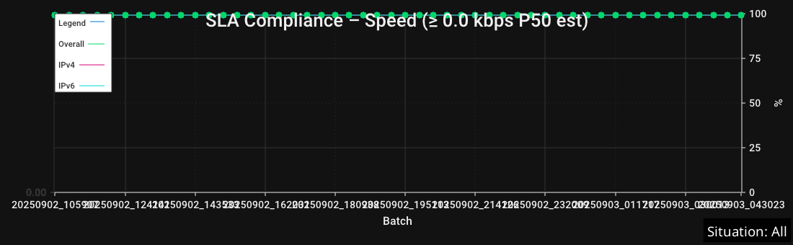

# iqmviewer

A Fyne-based desktop viewer for InternetQualityMonitor results with clear charts, robust filtering by Situation, rolling trend overlays, and export-ready watermarks.

## Build and run

```
go build ./cmd/iqmviewer
./iqmviewer -file monitor_results.jsonl
```

You can also launch without a flag and open a file via File → Open (Cmd/Ctrl+O).

## Features at a glance
- Load `monitor_results.jsonl` and display the latest N batches (grouped by `run_tag`).
- Situation filter with "All" option (default). The active Situation appears as a subtle on-image watermark and is embedded into exports.
- X-axis modes: Batch, RunTag, and Time with rounded ticks. Y-scale: Absolute or Relative.
- Speed units: kbps, kBps, Mbps, MBps, Gbps, GBps.
- Crosshair overlay: theme-aware, follows mouse, label with semi-transparent background; hidden outside drawn area.
- PNG export for each chart plus an "Export All (One Image)" that mirrors the on-screen order.
- Keyboard shortcuts: Open (Cmd/Ctrl+O), Reload (Cmd/Ctrl+R), Close window (Cmd/Ctrl+W).

## Stability & quality charts

- Low‑Speed Time Share (%): Share of total transfer time spent below the Low‑Speed Threshold. Highlights choppiness even when averages look OK. Plotted for Overall, IPv4, and IPv6.
- Stall Rate (%): Percent of requests that experienced any stall (transfer paused). Useful to spot buffering/outage symptoms.
- Avg Stall Time (ms): Average total stalled time per stalled request. Higher means longer buffering events.
- Stalled Requests Count: Derived as round(Lines × Stall Rate%). Quick absolute sense of how many requests stalled in a batch.

Examples:


Low‑Speed Threshold control

- Toolbar field “Low‑Speed Threshold (kbps)” sets the cutoff used for Low‑Speed Time Share.
- Persisted in preferences and applied immediately on change (data is re‑analyzed).
- Default: 1000 kbps. Tune to your baseline (e.g., 500 for low‑bandwidth links, 2000 for HD video expectations).
- Exports: Individual and combined PNG exports include the active Situation watermark. The threshold affects Low‑Speed Time Share only; stall metrics are independent.

## Rolling overlays: mean and ±1σ band

- Rolling window: Default N = 7 batches (persisted). Change via toolbar “Rolling Window (N)”.
- Overlays available on Avg Speed and Avg TTFB charts:
	- Rolling Mean (μ): a smoothed trend line over the last N batches.
	- ±1σ Band: translucent band between μ−σ and μ+σ.
- Independent toggles:
	- “Rolling Mean” checkbox shows/hides the mean line.
	- “±1σ Band” checkbox shows/hides the band separately from the mean.
- Legend: a single entry “Rolling μ±1σ (N)” appears per chart when the band is enabled. The mean line label remains concise.
- Help: Speed/TTFB help dialogs include a quick hint explaining the μ±1σ band and how the window N affects smoothing and band width.

Example (Avg Speed with Rolling overlays):


## Exports and order

- Individual exports per chart and a combined export: "Export All (One Image)" stitches charts in the same order as on screen.
- Each exported image embeds the Situation watermark for context preservation.
- A dedicated export exists for the Stalled Requests Count chart.

### Updating the screenshots

You can regenerate the screenshots headlessly from your latest results:

Option A (helper script):

```
./update_screenshots.sh [monitor_results.jsonl] [SituationLabel|All]
```

Option B (manual):

```
go build ./cmd/iqmviewer
./iqmviewer -file monitor_results.jsonl \
	--screenshot \
	--screenshot-outdir docs/images \
	--screenshot-situation All \
	--screenshot-rolling-window 7 \
	--screenshot-rolling-band
```

Screenshots will be written to `docs/images`. The Situation watermark is embedded.

SLA examples:




## Preferences (persisted)

- Last Situation, axis modes, speed unit, crosshair visibility, SLA thresholds, Low‑Speed Threshold, Rolling Window (N), Rolling Mean toggle, and ±1σ Band toggle.

## Design
- Offscreen rendering via go-chart, displayed as PNG with ImageFillContain.
- Summaries come from `analysis.AnalyzeRecentResultsFullWithOptions` (situation filter and low-speed threshold propagated into analysis).
- Robust range handling and single-point padding avoid rendering glitches on sparse data.
- Nice time ticks via `pickTimeStep` + `makeNiceTimeTicks`, actual data timestamps are preserved.

## Troubleshooting
- Too few batches? Ensure JSONL has distinct `run_tag` per batch; many lines with the same `run_tag` count as a single batch.
- Verify filtering: the app logs situation line counts after each load.
- Black or empty charts? For stall metrics, zeros are meaningful and are plotted; if you still see issues, check the logs panel.
- Large files: analysis reads only the recent batches window; still, consider rotating old data if start-up is slow.
- Line size cap: The analysis layer uses a dynamic line reader with a 200MB per-line cap to avoid OOM.
	- To raise the cap, edit `src/analysis/analysis.go` and update `const MaxLineBytes`.
