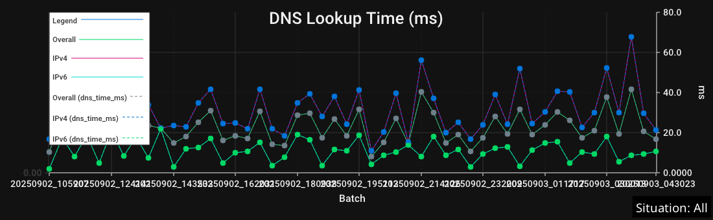
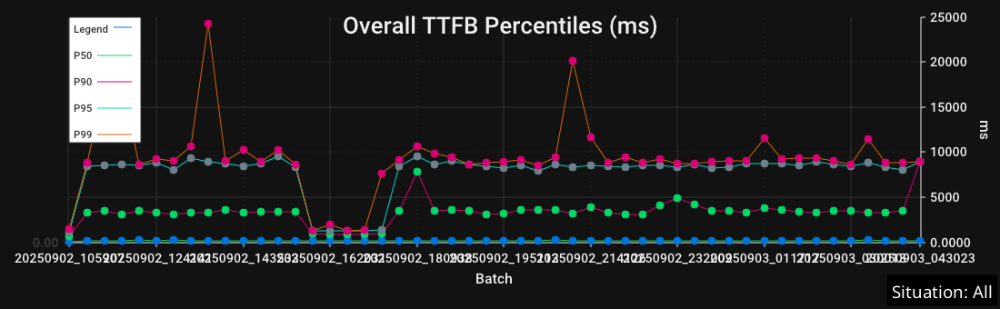
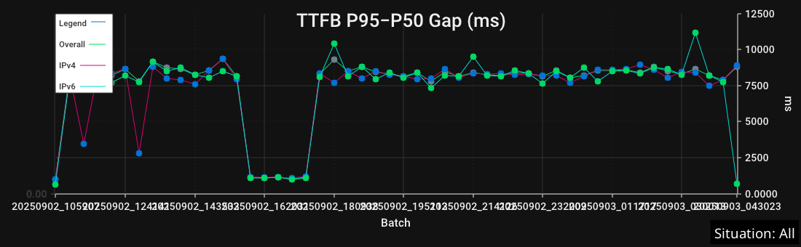
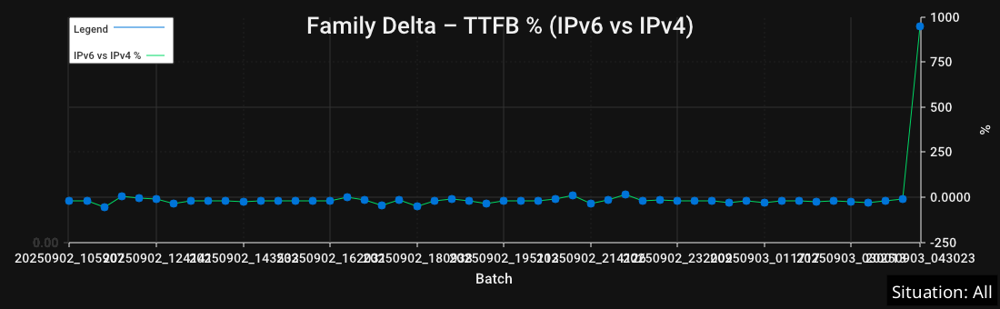
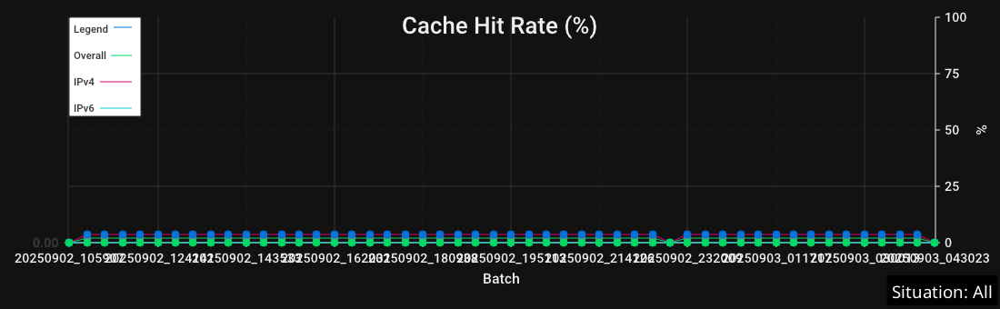
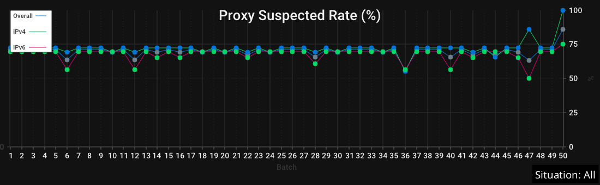
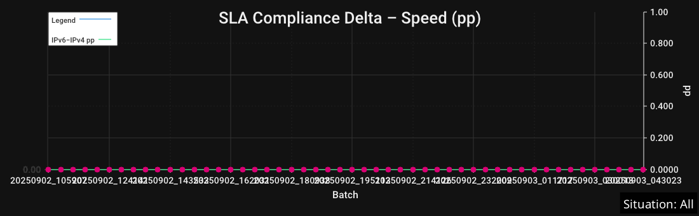
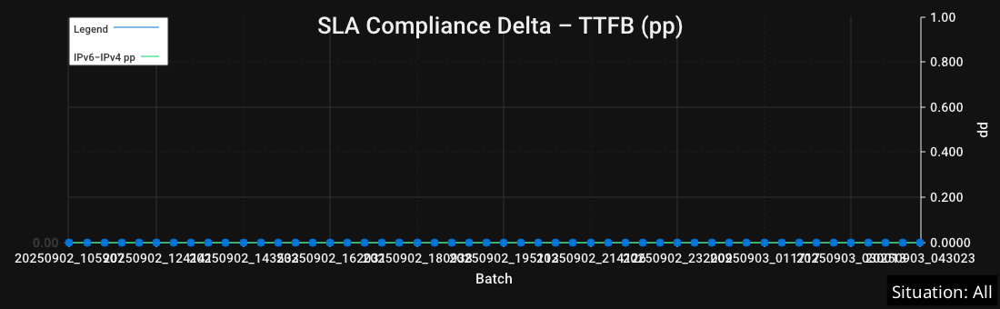

# iqmviewer

A Fyne-based desktop viewer for InternetQualityMonitor results with clear charts, robust filtering by Situation, rolling trend overlays, and export-ready watermarks.

- All charts render at 100% of the available width, across the entire viewer.
- The toolbar is horizontally scrollable so the window can be resized to narrow widths.
- The window can be freely resized; redraws are debounced to avoid feedback loops.

## Build and run

```
go build ./cmd/iqmviewer
./iqmviewer -file monitor_results.jsonl
```

You can also launch without a flag and open a file via File → Open (Cmd/Ctrl+O).

## Features at a glance
- Load `monitor_results.jsonl` and display the latest N batches (grouped by `run_tag`).
- Situation filter with "All" option (default). The active Situation appears as a subtle on-image watermark and is embedded into exports.
- X-axis modes: Batch, RunTag, and Time (Settings → X-Axis) with rounded ticks. Y-scale: Absolute or Relative (Settings → Y-Scale).
- Speed units: kbps, kBps, Mbps, MBps, Gbps, GBps (select under Settings → Speed Unit).
- Crosshair overlay: theme-aware, follows mouse, label with semi-transparent background; hidden outside drawn area.
- PNG export for each chart plus an "Export All (One Image)" that mirrors the on-screen order.
- Quick find: toolbar Find field filters by chart title and lets you jump Prev/Next between matches; count shows current/total.
- Keyboard shortcuts: Open (Cmd/Ctrl+O), Reload (Cmd/Ctrl+R), Close window (Cmd/Ctrl+W), Find (Cmd/Ctrl+F).
 - New setup timing charts: DNS Lookup Time (ms), TCP Connect Time (ms), TLS Handshake Time (ms), each split Overall/IPv4/IPv6.

### Settings menu
- Crosshair, Hints, Rolling Mean overlay, and ±1σ Band toggles
- Overlay legacy DNS (dns_time_ms) toggle for the DNS chart
- X-Axis: Batch, RunTag, Time
- Y-Scale: Absolute, Relative
- Batches…: set recent N batches
- Speed Unit: kbps, kBps, Mbps, MBps, Gbps, GBps
- Screenshot Theme: Auto, Dark, Light

### Layout and sizing
- Full-width charts: images use a stretch fill to visually occupy the entire available width.
- Flexible window size: the window can be made narrow; the toolbar scrolls horizontally when there’s not enough space.
- Debounced resize: viewer redraws on meaningful width changes only (guarded to prevent jitter-driven redraw loops).

### Theme selection
- Settings → Screenshot Theme: Auto (default), Dark, Light.
- Auto follows the system appearance on macOS; other OSes default to Light unless you pick Dark.
- All charts and overlays are theme-aware (no stray white fills). Hints and watermarks use high-contrast colors per theme.

Headless equivalents:
- `--screenshot-theme` accepts `auto`, `dark`, or `light`.
- Extra average “action” variants (time-axis and relative-scale) are gated by `--screenshot-variants` (`averages` or `none`).

## Stability & quality charts

- Low‑Speed Time Share (%): Share of total transfer time spent below the Low‑Speed Threshold. Highlights choppiness even when averages look OK. Plotted for Overall, IPv4, and IPv6.
- Stall Rate (%): Percent of requests that experienced any stall (transfer paused). Useful to spot buffering/outage symptoms.
- Pre‑TTFB Stall Rate (%): Percent of requests aborted before the first byte due to a pre‑TTFB stall. Hidden when the metric is zero across all batches. Requires running the monitor with `IQM_PRE_TTFB_STALL=1` to record this signal.
- Partial Body Rate (%): Percent of requests that returned an incomplete body (Content‑Length mismatch or early EOF). Plotted for Overall, IPv4, and IPv6. Full‑width, crosshair‑enabled, and exportable; included in headless screenshots as `partial_body_rate.png`.
- Avg Stall Time (ms): Average total stalled time per stalled request. Higher means longer buffering events.
- Stalled Requests Count: Derived as round(Lines × Stall Rate%). Quick absolute sense of how many requests stalled in a batch.

Examples:


## Setup timing charts (connection setup)

- DNS Lookup Time (ms): Mean DNS resolution time per batch (Overall/IPv4/IPv6). Helps spot resolver slowness or cache coldness.
- TCP Connect Time (ms): Mean TCP handshake time per batch. Useful for path RTT shifts or congestion.
- TLS Handshake Time (ms): Mean TLS setup time per batch. Highlights certificate/inspection overhead or handshake retries.

DNS data sources and overlay
- Preferred source is httptrace (trace_dns_ms). When unavailable, the legacy dns_time_ms is used.
- You can also overlay the legacy pre-resolve series: Settings → “Overlay legacy DNS (dns_time_ms)” adds a dashed overlay for comparison (Overall/IPv4/IPv6).
	- Headless: pass --screenshot-dns-legacy=true (or set the 7th arg to true in update_screenshots.sh) to include the dashed overlay in docs screenshots.

Examples:




Low‑Speed Threshold control

- Settings → “Low‑Speed Threshold (kbps)” sets the cutoff used for Low‑Speed Time Share.
- Persisted in preferences and applied immediately on change (data is re‑analyzed).
- Default: 1000 kbps. Tune to your baseline (e.g., 500 for low‑bandwidth links, 2000 for HD video expectations).
- Exports: Individual and combined PNG exports include the active Situation watermark. The threshold affects Low‑Speed Time Share only; stall metrics are independent.

## Rolling overlays: mean and ±1σ band

- Rolling window: Default N = 7 batches (persisted). Change via Settings → “Rolling Window (N)”.
- Overlays available on Avg Speed and Avg TTFB charts:
	- Rolling Mean (μ): a smoothed trend line over the last N batches.
	- ±1σ Band: translucent band between μ−σ and μ+σ.
- Independent toggles:
	- Settings → “Rolling Overlays” toggles the mean line.
	- Settings → “±1σ Band” toggles the band separately from the mean.
- Legend: a single entry “Rolling μ±1σ (N)” appears per chart when the band is enabled. The mean line label remains concise.
- Help: Speed/TTFB help dialogs include a quick hint explaining the μ±1σ band and how the window N affects smoothing and band width.

Example (Avg Speed with Rolling overlays):


## Local Throughput Self-Test (baseline)

- On startup, the viewer runs a short local loopback throughput self-test by default and records the baseline (kbps).
- The baseline is visualized in a dedicated “Local Throughput Self-Test” chart and used as context for speed expectations.
- Exports: The chart has its own export item and can be included in headless screenshot runs.
- Controls:
	- Runtime flags: `--selftest-speed=true|false` (default true), `--selftest-duration=300ms`.
	- Headless screenshots: `--screenshot-selftest=true|false` (default true) to include/exclude this chart.

## Percentiles (variability)

- Speed Percentiles: median and tails per batch (P50/P90/P95/P99). Wide gaps suggest unstable throughput.
- TTFB Percentiles: median and tail latency (ms) per batch (P50/P90/P95/P99).

Examples:




## Tail and gap metrics

- Tail Heaviness (Speed P99/P50): dimensionless ratio capturing head vs tail spread.
- TTFB Tail Heaviness (P95/P50): dimensionless latency tail ratio.
- TTFB P95−P50 Gap (ms): absolute tail-minus-median latency distance.

Examples:




## IPv6 vs IPv4 deltas

- Speed Delta (IPv6−IPv4) absolute and percent vs IPv4.
- TTFB Delta (IPv4−IPv6) absolute and percent vs IPv6.

Examples:




## Cache / proxy indicators

- Cache Hit Rate, Proxy Suspected Rate, Warm Cache Suspected Rate.

Examples:





## Error, jitter, and stability extras

- Error Rate, Jitter, Coefficient of Variation (CoV).
- Plateau metrics: Count, Longest, Stable Share.

Examples:


## Exports and order

- Individual exports per chart and a combined export: "Export All (One Image)" stitches charts in the same order as on screen.
- Each exported image embeds the Situation watermark for context preservation.
- A dedicated export exists for the Stalled Requests Count chart.
 - Setup timing charts (DNS/TCP/TLS) are included in both individual and combined exports.

### Updating the screenshots

You can regenerate the screenshots headlessly from your latest results:

Option A (helper script):

```
./update_screenshots.sh [RESULTS_FILE] [SITUATION] [THEME] [VARIANTS] [BATCHES] [LOW_SPEED_KBPS]
```

Option B (manual):

```
go build ./cmd/iqmviewer
./iqmviewer -file monitor_results.jsonl \
	--screenshot \
	--screenshot-outdir docs/images \
	--screenshot-situation All \
	--screenshot-batches 50 \
	--screenshot-rolling-window 7 \
	--screenshot-rolling-band \
	--screenshot-theme auto \
	--screenshot-variants averages \
	--screenshot-low-speed-threshold-kbps 1000 \
	--screenshot-dns-legacy false \
	--screenshot-selftest true
```

Screenshots will be written to `docs/images`. The Situation watermark is embedded.

Generated filenames for setup timing charts:
- `dns_lookup_time.png`
- `tcp_connect_time.png`
- `tls_handshake_time.png`

SLA examples:


SLA deltas (percentage points):





## “Action” variants (optional)

For more dynamic visuals, the generator also creates:
- Time-axis variants of averages: `speed_avg_time.png`, `ttfb_avg_time.png`.
- Relative-scale variants of averages: `speed_avg_relative.png`, `ttfb_avg_relative.png`.

These help emphasize movement over time or relative variation when absolute baselines differ.

## Preferences (persisted)

- Last Situation, axis modes, speed unit, crosshair visibility, SLA thresholds, Low‑Speed Threshold, Rolling Window (N), Rolling Mean toggle, ±1σ Band toggle, Overlay legacy DNS, and Screenshot Theme mode (Auto/Dark/Light).

## Design
- Offscreen rendering via go-chart, displayed as PNG with ImageFillStretch to occupy full width.
Run with a results file to open the UI:
- Redraw on resize: a debounced watcher triggers chart redraws only when the canvas width changes beyond a small threshold.
- Summaries come from `analysis.AnalyzeRecentResultsFullWithOptions` (situation filter and low-speed threshold propagated into analysis).
- Robust range handling and single-point padding avoid rendering glitches on sparse data.
- Nice time ticks via `pickTimeStep` + `makeNiceTimeTicks`, actual data timestamps are preserved.

## Tests
- Width determinism (headless):
	- `TestScreenshotWidths_BaseSet` ensures all generated screenshots share the same width.
go run ./cmd/iqmviewer -screenshot -file monitor_results.jsonl -screenshot-outdir docs/images
- Run:

Flags:
- -file: Path to monitor_results.jsonl (defaults to ./monitor_results.jsonl if omitted in screenshot mode)
- -screenshot: Run in headless screenshot mode and save charts
- -screenshot-outdir: Output directory (created if missing), default docs/images
- -screenshot-situation: Situation label to render; use 'All' for all situations
- -screenshot-rolling-window: Rolling window N for overlays (default 7)
- -screenshot-rolling-band: Show ±1σ band in screenshots (default true)
- -screenshot-low-speed-threshold-kbps: Threshold for Low-Speed Time Share (default 1000)
- -screenshot-batches: How many recent batches to include (default 50)
- -screenshot-theme: 'auto' | 'dark' | 'light' (default auto)
- -screenshot-variants: 'none' | 'averages' (default 'averages')
- -screenshot-dns-legacy: Overlay dashed legacy dns_time_ms on the DNS chart (default false)
- -screenshot-selftest: Include the Local Throughput Self-Test chart (default true)
```
go test ./cmd/iqmviewer -run TestScreenshotWidths_ -v
```

## Troubleshooting
- Too few batches? Ensure JSONL has distinct `run_tag` per batch; many lines with the same `run_tag` count as a single batch.
- Verify filtering: the app logs situation line counts after each load.
- Black or empty charts? For stall metrics, zeros are meaningful and are plotted; if you still see issues, check the logs panel.
- Large files: analysis reads only the recent batches window; still, consider rotating old data if start-up is slow.
- Line size cap: The analysis layer uses a dynamic line reader with a 200MB per-line cap to avoid OOM.
	- To raise the cap, edit `src/analysis/analysis.go` and update `const MaxLineBytes`.
